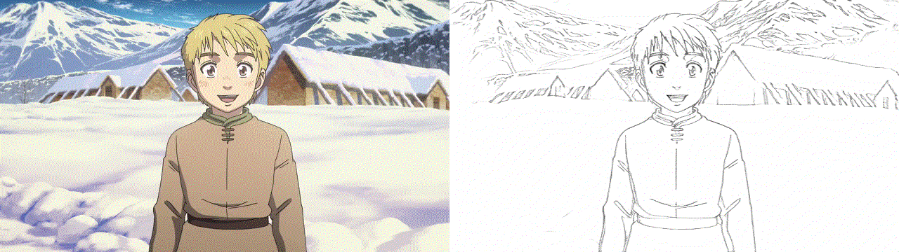
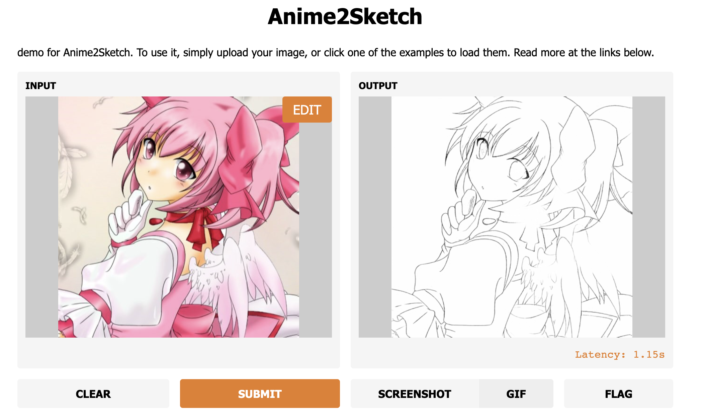
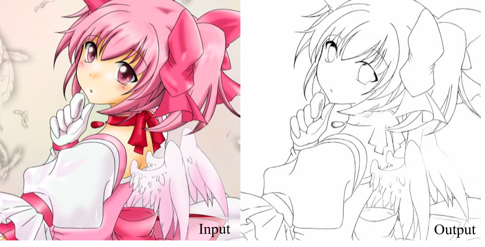
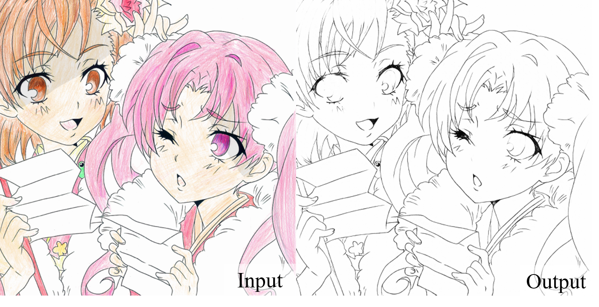
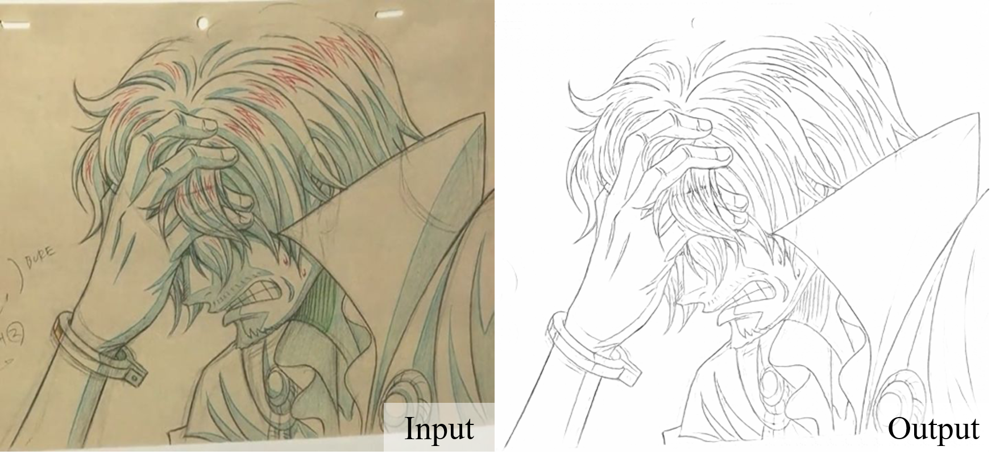
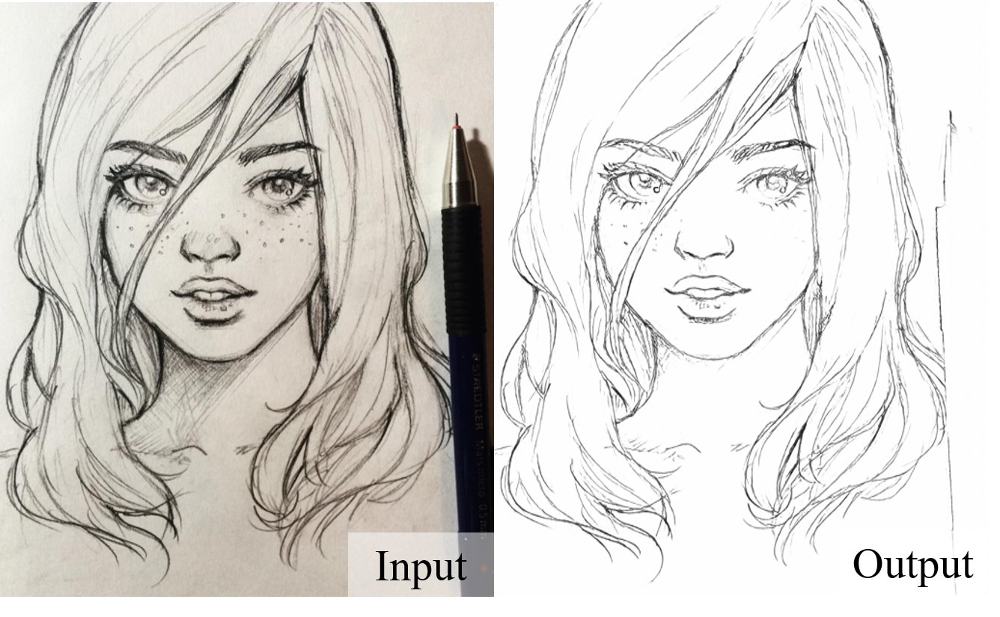
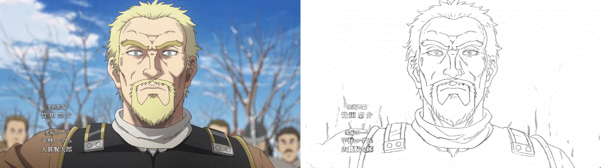
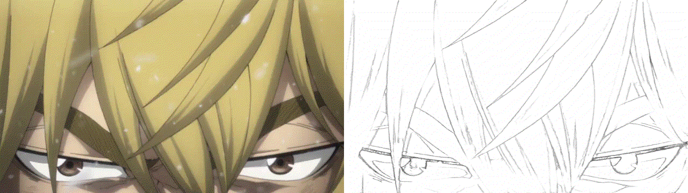

# Anime2Sketch
*Anime2Sketch: A sketch extractor for illustration, anime art, manga*

By [Xiaoyu Xiang](https://engineering.purdue.edu/people/xiaoyu.xiang.1)




## Updates
- 2022.1.14: Add Docker environment by [**kitoria**](https://github.com/kitoriaaa)
- 2021.12.25: Update README. Merry Christmas!
- 2021.5.24: Fix an interpolation error and a GPU inference error.
- 2021.5.12: [Web Demo](https://gradio.app/g/AK391/Anime2Sketch) by [**AK391**](https://github.com/AK391)

- 2021.5.2: Upload more example results of anime video.
- 2021.4.30: Upload the test scripts. Now our repo is ready to run!
- 2021.4.11: Upload the pretrained weights, and more test results.
- 2021.4.8: Create the repo.

## Introduction
The repository contains the testing codes and pretrained weights for Anime2Sketch.

Anime2Sketch is a sketch extractor that works well on illustration, anime art, and manga. It is an application based on the paper ["Adversarial Open Domain Adaption for Sketch-to-Photo Synthesis"](https://arxiv.org/abs/2104.05703).

## Prerequisites
- Linux, macOS, Docker
- Python 3 (Recommend to use [Anaconda](https://www.anaconda.com/download/#linux))
- CPU or NVIDIA GPU + CUDA CuDNN
- [Pillow](https://pillow.readthedocs.io/en/stable/), [PyTorch](https://pytorch.org/)


## Get Started
### Installation 
Install the required packages: ```pip install -r requirements.txt```

### Download Pretrained Weights
Please download the weights from [GoogleDrive](https://drive.google.com/drive/folders/1Srf-WYUixK0wiUddc9y3pNKHHno5PN6R?usp=sharing), and put it into the [weights/](weights/) folder.

### Test
```Shell
python3 test.py --dataroot /your_input/dir --load_size 512 --output_dir /your_output/dir
```
The above command includes three arguments:
- dataroot: your test file or directory
- load_size: due to the memory limit, we need to resize the input image before processing. By default, we resize it to `512x512`.
- output_dir: path of the output directory

Run our example:
```Shell
python3 test.py --dataroot test_samples/madoka.jpg --load_size 512 --output_dir results/
```

### Docker
If you want to run on Docker, you can easily do so by customizing the input/output images directory.  
Build docker image  
```Shell
make docker-build
```

Setting input/output directory  
You can customize mount volumes for input/output images by Makefile. Please setting your target directory.  
```
docker run -it --rm --gpus all -v `pwd`:/workspace -v {your_input_dir}:/input -v {your_output_dir}:/output anime2sketch
```

example:  
```
docker run -it --rm --gpus all -v `pwd`:/workspace -v `pwd`/test_samples:/input -v `pwd`/output:/output anime2sketch
```

Run  
```Shell
make docker-run
```

if you want to run **cpu only**, you will need to fix two things (remove gpu options).
- Dockerfile CMD line to ```CMD [ "python", "test.py", "--dataroot", "/input", "--load_size", "512", "--output_dir", "/output" ]``` 
- Makefile docker-run line to ```docker run -it --rm -v `pwd`:/workspace -v `pwd`/images/input:/input -v `pwd`/images/output:/output anime2sketch```

### Train
This project is a sub-branch of [AODA](https://github.com/Mukosame/AODA). Please check it for the training instructions.

## More Results
Our model works well on illustration arts:


Turn handrawn photos to clean linearts:

Simplify freehand sketches:

And more anime results:



## Contact
[Xiaoyu Xiang](https://engineering.purdue.edu/people/xiaoyu.xiang.1).

You can also leave your questions as issues in the repository. I will be glad to answer them!

## License
This project is released under the [MIT License](LICENSE).

## Citations
```BibTex
@misc{Anime2Sketch,
  author = {Xiaoyu Xiang, Ding Liu, Xiao Yang, Yiheng Zhu, Xiaohui Shen},
  title = {Anime2Sketch: A Sketch Extractor for Anime Arts with Deep Networks},
  year = {2021},
  publisher = {GitHub},
  journal = {GitHub repository},
  howpublished = {\url{https://github.com/Mukosame/Anime2Sketch}}
}

@inproceedings{xiang2022adversarial,
  title={Adversarial Open Domain Adaptation for Sketch-to-Photo Synthesis},
  author={Xiang, Xiaoyu and Liu, Ding and Yang, Xiao and Zhu, Yiheng and Shen, Xiaohui and Allebach, Jan P},
  booktitle={Proceedings of the IEEE/CVF Winter Conference on Applications of Computer Vision},
  year={2022}
}
```
